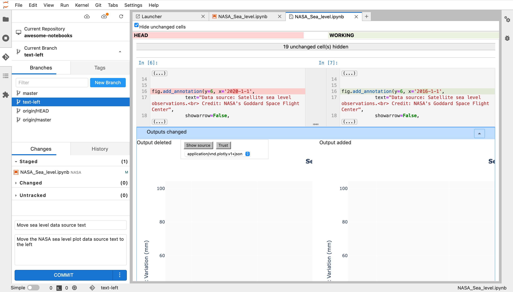
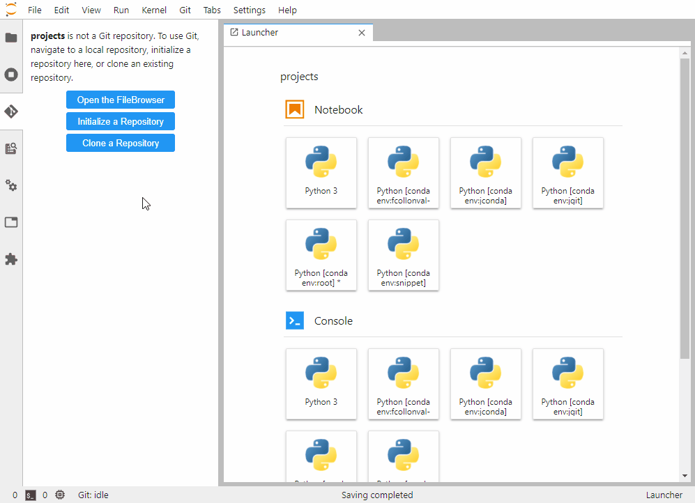

# glb_equal for Geo-188660

怎么看这个文档可能更好右键 → Open With → Markdown Preview

## 代码库维护准则

- 尽可能的规范。我们不是计算机、统计学专业，但是要学习他们高度结构化的思维，文档管理是否规范，体现了思路，也会影响后续效率。我也是第一次和人合作管理文档，很多东西先试试规范起来。
- 尽可能的简洁。不要过度追求文档管理的形式化与结构化，我们是业余，很多时候把自己的业务逻辑弄清楚是第一位，不一定要加入很多奇奇怪怪的东西。
- 尽可能的持续。AI时代，有很多过程性文件很正常自己需要定期维护、清理代码，避免制造过多垃圾。无论要不要、想不想成为分析专家，高频迭代永远是保持学习的不二法门。

## How we use this repository

本项目用于全球降雨数据的地理空间分析和可视化。

## 📁 项目结构

```
glb_equal/
├── docs/                    # 📖 项目文档 (必读！)
│   ├── README.md           # 文档使用说明
│   ├── 01_data_schema.md   # 数据结构定义
│   ├── 02_api_specs.md     # API接口规范
│   └── 03_business_flows.md # 业务流程
│
├── src/                     # 别人的参考源代码等可以放这里
│   └── (待添加源代码文件)
│
├── data/                    # 输入数据目录 (gitignore)
│   ├── cb_2018_us_county_500k.*  # 美国县级行政边界数据
│   ├── cb_2018_us_state_500k.*   # 美国州级行政边界数据
│   ├── merge._freq-point.*       # 频率点shapefile数据
│   ├── dayu.xlsx                 # 降雨数据Excel文件
│   └── df_weight.csv             # 权重数据CSV文件
│
├── data_output/             # 输出数据目录 (gitignore)
│   ├── world_shp_agg.*          # 聚合后的全球shapefile数据
│   ├── world_shp_agg_1973_2024.* # 1973-2024年聚合数据
│   └── world_shp_agg_all.csv    # 所有聚合数据CSV
│
├── figure/                  # 图表输出目录 (gitignore)
│   └── 3d_density_*.png         # 3D密度图PNG格式
│
├── functions/               # 函数模块（如适用）
│   └── (待添加函数文件)
│
│
│                           #（这部分在主目录当中，记录你的分析过程）
├── Figure1_3Dmap.ipynb     # 3D地图可视化notebook
├── glb_rain.ipynb          # 全球降雨数据处理notebook
└── README.md               # 基本规范
```

## 📝 存储规范

- 参考源代码放在 `src/` 目录
- 数据文件统一放在 `data/` 目录（已配置 gitignore）
- 输出数据放在 `data_output/` 目录（已配置 gitignore）
- 图表输出放在 `figure/` 目录（已配置 gitignore）
- 函数模块放在 `functions/` 目录
- Jupyter notebook放在项目根目录，记录分析过程
- 所有配置使用 `config.yaml`（不要提交到版本控制）


## 📊 核心文件说明

- 既然是合作性内容，也可以尝试让合作者去看懂你的文档，定期随便乱写几句话，去形容.ipynb做了什么
- 用相对目录管理，不管你放在C\tianyu\city还是放在D\tianyu\rural，就把这个项目当作一个整体，进入了项目后这就自成一个小世界。所有除非你在某个这个项目的某个文件夹内部设计到跨层级调用，不然统一使用\data\xxx.csv进行管理


### Jupyter Notebooks（重要！！！）

| 文件名 | 说明 | 主要功能 |
|--------|------|---------|
| `Figure1_3Dmap.ipynb` | 3D地图可视化 | 生成3D密度图和空间可视化 |
| `glb_rain.ipynb` | 全球降雨数据处理 | 处理shapefile数据，进行空间分析和聚合 |

### 输入数据清单（重要！！！）

| 文件路径 | 数据类型 | 说明 |
|---------|---------|------|
| `data/cb_2018_us_county_500k.*` | Shapefile | 美国县级行政边界数据（2018年） |
| `data/cb_2018_us_state_500k.*` | Shapefile | 美国州级行政边界数据（2018年） |
| `data/merge._freq-point.*` | Shapefile | 频率点空间数据 |
| `data/dayu.xlsx` | Excel | 降雨数据，包含10年重现期等字段 |
| `data/df_weight.csv` | CSV | 权重数据 |

在我们预处理数据时，可以把自己的数据结构尽可能理清楚一点，比如我们使用的表格型数据

#### 1. 社会经济数据表

**文件**: `data/tabular/socio_economic.csv`

| 字段名                   | 类型    | 说明                       | 示例值        |
|--------------------------|---------|----------------------------|--------------|
| region_id                | string  | 区县/城市唯一标识           | 320100       |
| region_name              | string  | 区县/城市名称               | 南京市        |
| year                     | int     | 年份                        | 2020         |
| 常住人口(万人)              | float   | 区域常住人口，单位：万人      | 931.5        |
| 城镇常住人口(万人)           | float   | 区域城镇常住人口，万人        | 800.2        |
| 常住人口城镇化率(%)          | float   | 区域常住人口城镇化率          | 85.9         |
| 地区生产总值(万元)            | float   | 地区生产总值（GDP），万元      | 148360000    |
| 第一产业增加值(万元)          | float   | 第一产业增加值，万元          | 6230000      |
| 第二产业增加值(万元)          | float   | 第二产业增加值，万元          | 58120000     |
| 第三产业增加值(万元)          | float   | 第三产业增加值，万元          | 83810000     |
| 第一产业从业人员数(万人)       | float   | 第一产业从业人员数，万人      | 12.3         |
| 第二产业从业人员数(万人)       | float   | 第二产业从业人员数，万人      | 234.1        |
| 第三产业从业人员数(万人)       | float   | 第三产业从业人员数，万人      | 321.6        |
| 社会消费品零售总额(万元)        | float   | 社会消费品零售总额，万元      | 8500000      |
| 固定资产投资总额(万元)          | float   | 固定资产投资总额，万元        | 9200000      |
| 房地产开发投资完成额(万元)      | float   | 房地产开发投资完成额，万元    | 3700000      |
| 货物出口额(万元)               | float   | 货物出口额，万元              | 2100000      |
| 货物进口额(万元)               | float   | 货物进口额，万元              | 1700000      |

说明：以上字段为实际可用字段，直接与脚本及下游数据结构一致。

#### 2. 栅格数据结构简要说明（GeoTIFF，.tif）

- 路径：`data/rainfall/precip_2020.tif`
- 空间分辨率：1km x 1km
- 行数×列数：1800 × 3600
- 左上角坐标：(-180.0, 90.0)
- 投影：EPSG:4326
- 变量含义：2020年降雨量（单位：mm）

#### 3. 气候网格数据结构简要说明（netCDF，.nc）

- 路径：`data/climate/precip_monthly_2020.nc`
- 维度：time（12），lat（180），lon（360）
- 起止坐标：lat -89.5~89.5，lon -179.5~179.5
- 分辨率：1° × 1°
- 主要变量：precip（降水量，单位：mm），time为2020年每月
说明：使用netCDF存储的多维气象/气候数据可以方便进行时空分析，常配合xarray等库使用。

### 输出数据清单（不重要）

| 文件路径 | 数据类型 | 说明 |
|---------|---------|------|
| `data_output/world_shp_agg.*` | Shapefile | 聚合后的全球shapefile数据 |
| `data_output/world_shp_agg_1973_2024.*` | Shapefile | 1973-2024年时间序列聚合数据 |
| `data_output/world_shp_agg_all.csv` | CSV | 所有聚合数据的CSV格式 |

### 图表输出（不重要）

| 文件路径 | 格式 | 说明 |
|---------|------|------|
| `figure/3d_density_10-year return period_300dpi.png` | PNG | 10年重现期3D密度图 |
| `figure/3d_density_*.png` | PNG | 其他3D密度图PNG格式 |
| `figure/3d_density_*.pdf` | PDF | 3D密度图PDF格式（如存在） |


### 环境配置文件（一般重要）

- `config.yaml` ：本地环境和库配置文件（如有）。推荐用于统一管理依赖包的版本，便于环境复现（不建议提交到版本库）。

**依赖库版本yaml配置示例：**

```yaml
# config.yaml 示例

python: "3.10"
numpy: "1.24.4"
geopandas: "0.14.2"
xarray: "2023.12.0"
pandas: "2.2.2"
matplotlib: "3.8.4"
scipy: "1.11.4"
# 可根据需求补充其他库及版本
```


一般建议在代码中统一读取和使用 `config.yaml` 的配置项，便于跨环境部署和复现。


**注意**：以下目录和文件均已在 `.gitignore` 配置，因此不会被提交到版本控制：
- `figure/` ：图表文件输出目录
- `data/` ：原始及中间数据存储目录
- `data_output/` ：结果数据输出目录
- `config.yaml` ：本地配置文件（如有）


请将临时文件、输出文件等均存放在上述目录，保证代码仓库的简洁性。


## 🛠️ 仓库合并


JupyterLab 官方生态里就有 Git 插件，能在 JupyterLab 里直接完成 clone / commit / push / pull / diff / branch，不需要频繁切终端。当然，你有cursor等IDE更好。







如需合并（merge）分支、解决冲突、或提交合并操作，可参考上方 `use_git.gif` 动图。建议通过 JupyterLab Git 插件或其他 IDE 自带 Git 工具，规范操作，确保代码协作同步且无冲突。

